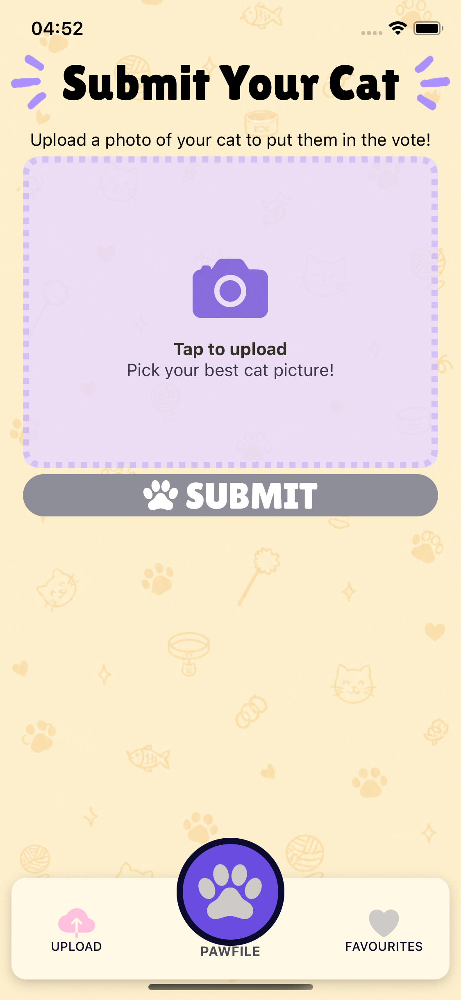
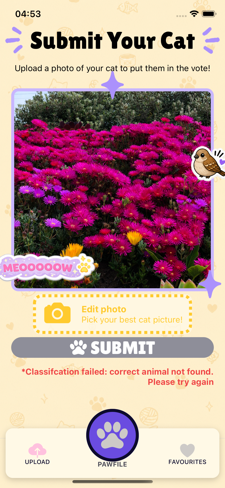
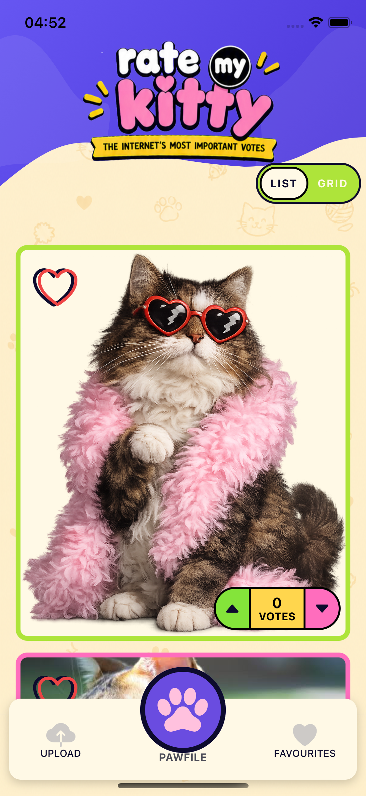
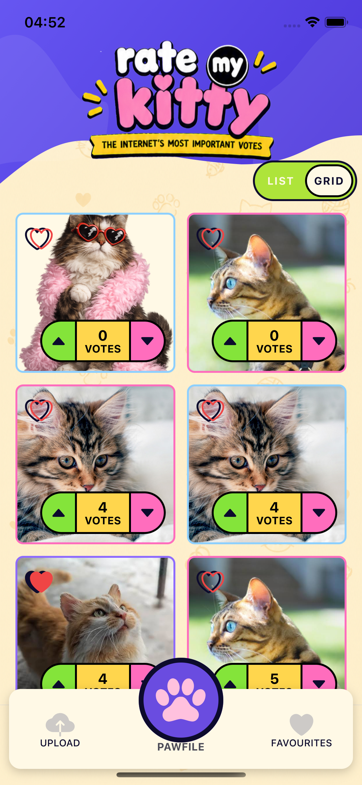
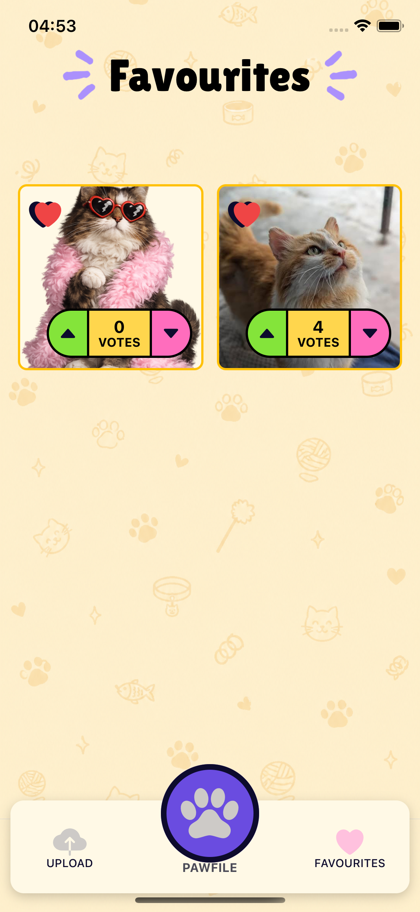

# Rate My Kitty

Rate My Kitty is a playful Expo app where users can submit cat photos, browse uploaded kitties, vote on them, and save their favourites.

<p align="center">
  
</p>

## App Preview

### Video

<video src="./docs/media/demo.mov" controls width="500">
  Your browser does not support embedded videos.
</video>

### Images

<p align="center">





  
  
  
</p>

## Features

- Upload cat images from your device.
- Browse uploaded cats in a swipeable gallery or grid layout.
- Upvote and downvote each cat.
- Save cats to a favourites tab.
- View custom empty, loading, and error states.
- Uses The Cat API for uploads, favourites, and votes.

## Built With

- [Expo](https://expo.dev/)
- [Expo Router](https://docs.expo.dev/router/introduction/)
- [React Native](https://reactnative.dev/)
- [TypeScript](https://www.typescriptlang.org/)
- [The Cat API](https://thecatapi.com/)

## Getting Started

### Prerequisites

- Node.js
- npm
- Expo Go, an iOS simulator, or an Android emulator
- A The Cat API key

### Installation

Install the project dependencies:

```bash
npm install
```

Create a `.env` file in the project root:

```bash
EXPO_PUBLIC_BASE_URL=https://api.thecatapi.com/v1
EXPO_PUBLIC_API_KEY=your_api_key_here
```

Start the development server:

```bash
npm start
```

Then follow the Expo terminal instructions to open the app on your preferred device or simulator.

## Scripts

```bash
npm start        # Start the Expo development server
npm run ios      # Start the app in an iOS simulator
npm run android  # Start the app in an Android emulator
npm run web      # Start the app on web
npm run lint     # Run Expo linting
```


## Tests
```bash
npx jest --coverage    # Run test coverage for all tests

open coverage/lcov-report/index.html   # Open all test coverage doc
```


## Project Structure

```text
app/          App routes and tab navigation
api/          The Cat API helpers
assets/       Images, icons, backgrounds, and animations
components/   Reusable UI components
constants/    Shared colors and layout values
context/      App-wide voting, favourites, and orientation state
hooks/        Feature hooks for uploads, profile images, votes, and favourites
helpers/      Image caching and helper utilities
```
